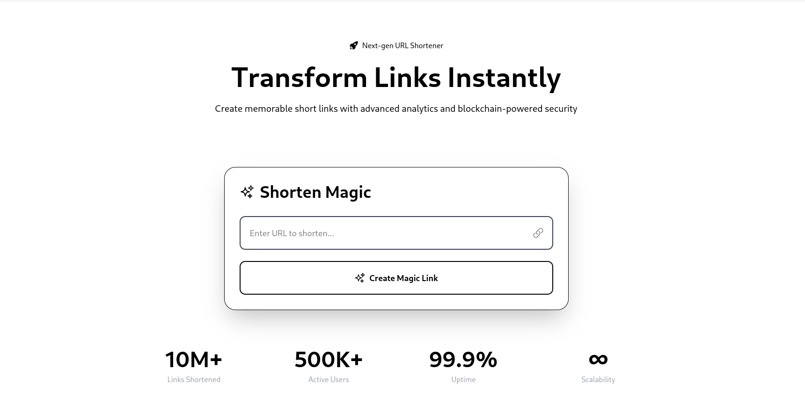

# SillyLink

SillyLink is a URL shortening service that allows users to create short, shareable links from long URLs, track click analytics, and manage links with user authentication. Built with **Next.js**, **Prisma**, and **TypeScript**, it provides a fast, secure, and scalable solution deployed on **Vercel**.

## Features

- **URL Shortening**: Generate short codes for long URLs.
- **Click Tracking**: Monitor clicks with analytics, including referral sources and geolocation data.
- **User Authentication**: Sign in via GitHub or Google using **NextAuth.js**.
- **Analytics Dashboard**: View link performance metrics (total clicks, average clicks, etc.).
- **Responsive Design**: Works seamlessly on desktop and mobile devices.
- **Secure**: Uses Prisma with Neon PostgreSQL for data persistence and secure authentication.

## Prerequisites

- **Node.js** (v18 or higher)
- **npm** (v8 or higher)
- **Git**
- **Vercel** account for deployment
- **Neon** account for PostgreSQL database
- **GitHub** and **Google** OAuth credentials for authentication
- **IPAPI** key for geolocation (optional)

